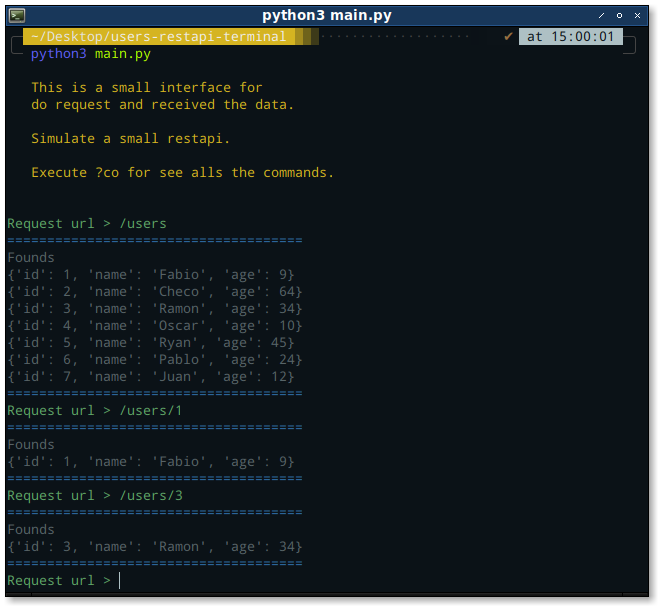
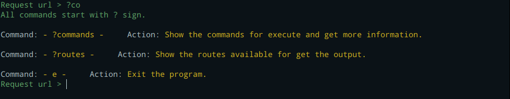

# Users Restapi Terminal.

__This is a simulation of a restapi of users from the teminal. Made with python.__

## Installation.

```bash
git clone http://github.com/EduardYan/users-restapi-terminal.git
```

## Run.

```bash
cd users-restapi-terminal
python3 main.py
```

## Screenshot.


__For see alls the commands execute ?co__
